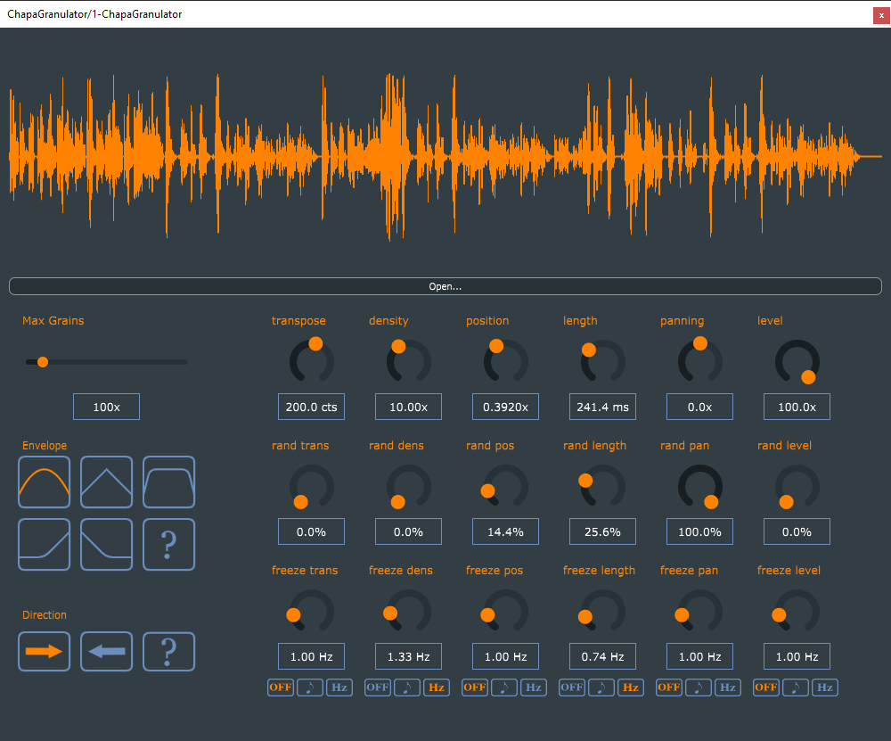

# ChapaGranulator
This plugin is a granulator VST developed with the JUCE Framework. It was inspired by the Quanta VST by Audio Damage and the GRNLR project developed by passivist. This plugin add a "freeze" functionality compared to other classical granulators that allow to freeze the random value taken for each parameter during a certain amount of time.

## How to use it

- Transpose : Overall transposition of the grains (in cents)
- Density : Number of grains played per second
- Position : Index position of each grain in the soundfile
- Length : Duration of each grain (in seconds)
- Panning : Panning of each grain
- Level : Amplitude of each grain
- Max Grains : Number maximum of grains played at the same time
- Envelope : Amplitude envelope of the grains
- Direction : Direction for the playback of each grain

The 6 principal parameters have each a random slider and a freeze slider.
A random slider allow to choose the amount of randomness for a parameter and the freeze slider allow to choose the amount of time a random value is freezed before a new value is generated.

## Video of demonstration

https://youtu.be/Pivn94sTtFk
